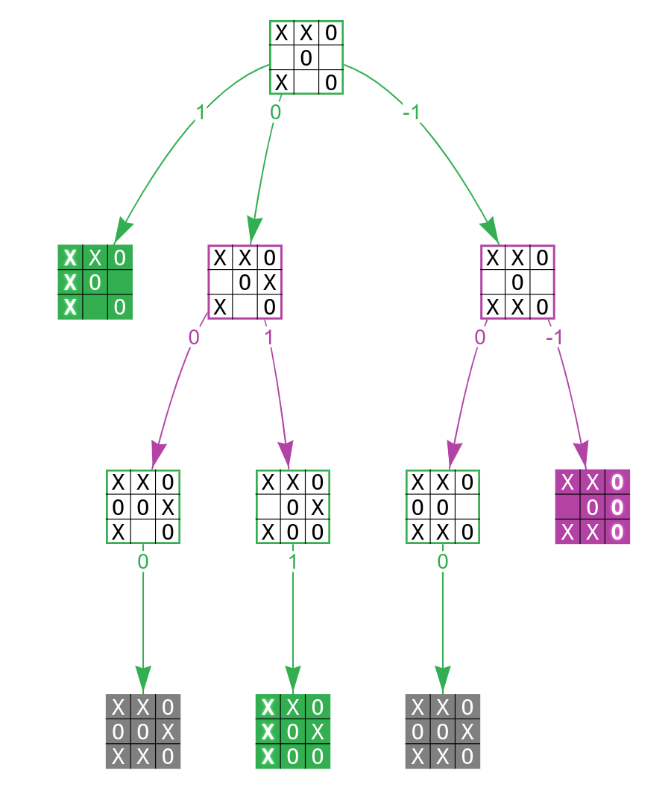

# Tic-Tac-Toe Game
Tic-tac-toe (American English), noughts and crosses (Commonwealth English), or Xs and Os (Canadian or Irish English) is a paper-and-pencil game for two players who take turns marking the spaces in a three-by-three grid with X or O. The player who succeeds in placing three of their marks in a horizontal, vertical, or diagonal row is the winner. It is a solved game, with a forced draw assuming best play from both players. [~Wiki]

### Objective
- build an extensible game engine with an unbeatable computer player that uses the minimax algorithm to play tic-tac-toe. 

---
**Concepts:**
- Object-oriented programming (OOP)
- Inheritance and composition
- Abstract classes
- Data classes
- Type hints
- Regular expressions
- Caching
- Recursion

# Steps
## 1. Model the Tic-Tac-Toe Game Domain
- Create the folder directory
- Edit the `pyproject.toml` file.
```
The pyproject.toml file is a standard configuration file using the TOML format for specifying minimum build system requirements for Python projects. The concept was introduced in PEP 518 and is now the recommended way of adding packaging metadata and configuration in Python. You’re going to need this to install the tic-tac-toe library into your virtual environment.
```
- Define the tic-tac-toe domain model objects in `models.py`
- Represent the Square Grid of Cells [**game’s board is represented by a three-by-three grid of cells in the classic tic-tac-toe. Each cell can be empty or marked with either a cross or a naught.**]
- Take a snapshot of the Player's move. [**model the player’s move so that artificial intelligence can evaluate and choose the best option.**]

An object representing the player’s move in tic-tac-toe should primarily answer the following two questions:
```
Player’s Mark: What mark did the player place?
Mark’s Location: Where was it placed?
```

A move object can’t validate itself without knowing some of the game details, such as the starting player’s mark, which aren’t available to it. You’ll check whether a given move is valid, along with validating a specific grid cell combination, in a class responsible for managing the game’s state.

- Determine the Game State:

```
A tic-tac-toe game can be in one of several states, including three possible outcomes:

The game hasn’t started yet.
The game is still going on.
The game has finished in a tie.
The game has finished with player X winning.
The game has finished with player O winning.
You can determine the current state of a tic-tac-toe game based on two parameters:

The combination of cells in the grid
The mark of the starting player
```

By convention, the player who marks the cells with crosses starts the game, hence the default value of Mark("X") for the starting player’s mark. 

- Introduce a Separate Validation Layer
- So, create `exceptions.py` and `validatiors.py` for GameState Validation.

- Discard Incorrect Game States

```
A starting player has an advantage, so when they win, they’ll have left more marks than their opponent. Conversely, the second player is at a disadvantage, so they can only win the game by making an equal number of moves as the starting player.
```

- Simulate Moves by Producing New Game States

## 2. Scaffold a generic tic-tac-toe game engine

- We have all the domain models defined for the tic-tac-toe library.
- Let's build a game engine to facilitate tic-tac-toe gameplay.
- Create `engine.py`, `players.py` and `renderers.py` inside `game` directory.

- Pull the Players’ Moves to Drive the Game [**need to have two players, something to draw on, and a set of rules to follow. We can express these elements as immutable data classes.**]

- Let the Computer Pick a Random Move. [**Implement 2 abstract base classes, Player and ComputerPlayer, as well as one concrete RandomComputerPlayer, which you’ll be able to use in your games.**]

- Make an Abstract Tic-Tac-Toe Grid Renderer

## 3. Build a Game Front End for the console

- Render the Grid With ANSI Escape Codes [**Implement a bare-bones game running in the text-based console.**]
- Edit the `frontends/console/renderers.py`.

- Create a script for playing between two computers.

- Create an Interactive Console player. [**play a tic-tac-toe match between a human and a computer player or two human players, in addition to the two computer players.**] - Create `players.py` and accept user input.

| Argument	| Default Value | Description |
| ----- | ----- | ----- |
|-X	| human	| Assigns X to the specified player |
|-O	| random	| Assigns O to the specified player |
|--starting	| X	|Determines the starting player’s mark |

- Human vs Human Player
```cmd
python -m console -X human -O human
```

- Human vs Random Player
```cmd
python -m console -X human -O random
```

## 4. Equip the Computer With Artificial Intelligence

- creating another computer player, this one equipped with basic artificial intelligence. Specifically, it’ll use the minimax algorithm.

```
The Minimax algorithm is a decision-making algorithm commonly used in two-player turn-based games like chess, checkers, Tic-Tac-Toe, and more. Its primary purpose is to determine the optimal move for a player, assuming that the opponent will also make optimal moves. The Minimax algorithm is built on the concept of minimizing the maximum possible loss, hence the name "Minimax."
```

- Evaluate the Score of a Finished Game [**three possible outcomes of the game, which you can assign arbitrary numeric values, for example:**]
    - Player loses: -1
    - Player ties: 0
    - Player wins: 1

**Strategy:**
- maximizing player will try to maximize the game’s overall score. Therefore, greater values should correspond to better outcomes, as viewed from their perspective. The minimizing player, on the other hand, is their opponent, who tries to lower the score as much as possible.

- express this numeric scale in Python code by adding the following method to your GameState model.



- In the above diagram: maximizing player X, whose turns are depicted in green.

- The minimax algorithm starts by recursively exploring the tree to look ahead and find all the possible game outcomes. Once those are found, it computes their scores and backtracks to the starting node. If it’s the maximizing player’s turn that leads to the next position, then the algorithm picks the maximum score at that level. Otherwise, it picks the minimum score, assuming the opponent will never make mistakes.

- Create a new `minimax` module and implement the algorithm and test it in `test.py`

- Make an undefeated Minimax computer player

- Human vs Minimax Computer (Never Win!)
```
(venv) $ cd frontends/
(venv) $ python -m console -X human -O minimax
```

# **Big Note:**
Run this project in a *virtual environment*.
- Create a virtual Environment
```cmd
cd .\tic-tac-toe\ 
python -m venv venv/
```
- Activate Virtual Environment
```cmd
cd .\tic-tac-toe\ 
cd .\venv\Scripts\
.\activate     
```
- Run the test script inside the tic-tac-toe library
```cmd   
cd .\library\src\tic_tac_toe\logic\
python .\test.py
```
- Run the play.py script to see see two artificial players making random moves, leading to different outcomes each time.
```cmd
cd ../..     
cd .\frontends\  
python .\play.py
```


# References
- https://realpython.com/tic-tac-toe-ai-python/#demo-tic-tac-toe-ai-player-in-python